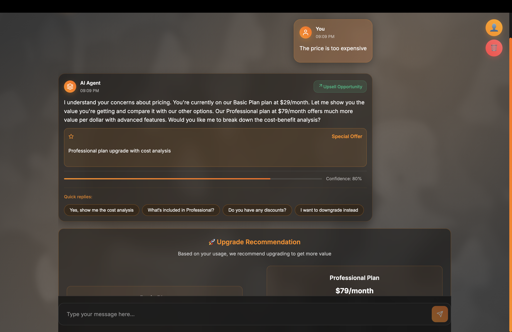
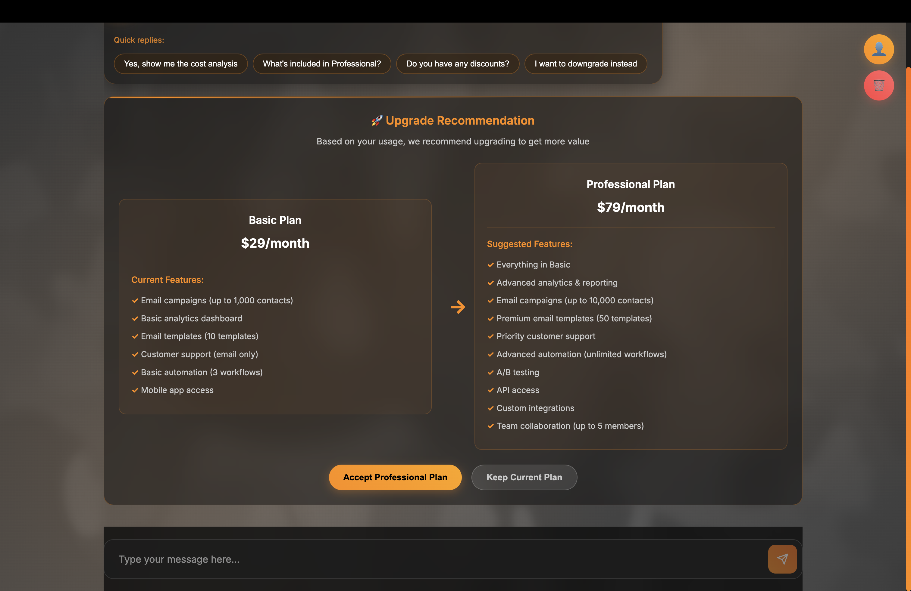
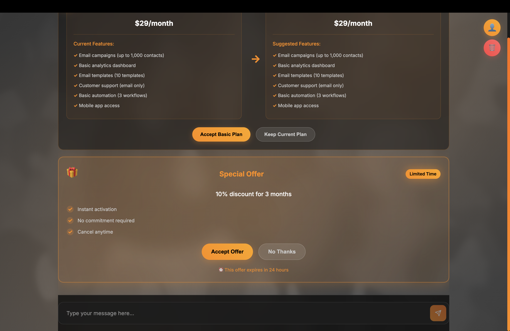

# 🚀 Retention and Upsell AI Agent

<div align="center">


**AI-powered customer retention and upsell agent with 35% churn reduction and 20% upsell boost**

</div>

---

## 📖 About

**Retention and Upsell AI Agent** is an AI-powered system designed to reduce customer churn and increase revenue through intelligent conversation management. Built with **LangChain**, **OpenAI GPT-4**, and **React**, this system delivers personalized retention strategies and automated upsell opportunities.

### Key Highlights

- 🎯 **35% Churn Risk Reduction** - Intelligent retention strategies
- 📈 **20% Upsell Boost** - Automated opportunity detection
- ⚡ **<1.5s Response Latency** - Optimized performance
- 🎯 **95% Intent Accuracy** - Advanced classification system
- 📊 **Real-time Analytics** - Live performance monitoring
- 🔄 **Hybrid Architecture** - Seamless fallback system

### 📸 Screenshots

<div align="center">

| Welcome Screen | Chat Interface |
|:---:|:---:|
|  |  |
| *Welcome interface with quick action buttons* | *Interactive chat with AI agent and quick replies* |

| Plan Comparison | Special Offer |
|:---:|:---:|
|  |  |
| *Visual plan comparison with upgrade path* | *Retention offer popup with discount details* |

</div>

---

## ✨ Features

- **🤖 AI Capabilities**: LangChain RAG system, GPT-4 integration, intent detection, conversation memory
- **🎯 Business Intelligence**: Churn risk analysis, upsell opportunity detection, personalized offers
- **🎨 User Experience**: Modern dark theme, interactive quick replies, plan comparisons, special offers
- **📊 Analytics**: Real-time dashboard, conversation logging, performance metrics

---

## 🛠️ Tech Stack

**Backend**: Python 3.12+, LangChain, OpenAI GPT-4, FAISS  
**Frontend**: React 18, Vite, Framer Motion  
**Infrastructure**: Netlify, GitHub

---

## 🚀 Quick Start

### Prerequisites

- Python 3.12+
- Node.js 18+
- OpenAI API Key ([Get one here](https://platform.openai.com/api-keys))

### Installation

1. **Clone the repository**
   ```bash
   git clone https://github.com/ArivunidhiA/Retention-and-Upsell-AI-Agent.git
   cd Retention-and-Upsell-AI-Agent
   ```

2. **Install dependencies**
   ```bash
   # Python dependencies
   pip install langchain langchain-community langchain-openai openai faiss-cpu
   
   # Node.js dependencies
   npm install
   ```

3. **Set up environment variables**
   ```bash
   echo "OPENAI_API_KEY=your_openai_api_key_here" > .env
   ```

4. **Build and start**
   ```bash
   # Build frontend
   npm run build
   
   # Start server
   python simple_server.py
   ```

5. **Access the application**
   - Main App: http://localhost:8000
   - Dashboard: http://localhost:8000/api/dashboard
   - Health Check: http://localhost:8000/api/health

---

## 🔧 Configuration

### Environment Variables

Create a `.env` file in the root directory:

```env
OPENAI_API_KEY=sk-your-openai-api-key-here
```

### Customization

- **Customer Data**: Edit `data/customers.json`
- **Product Catalog**: Update `data/products.json`
- **UI Theme**: Modify CSS variables in `src/index.css`
- **AI Behavior**: Adjust prompts in `simple_server.py`

---

## 📁 Project Structure

```
Retention-and-Upsell-AI-Agent/
├── src/                    # React frontend
│   ├── components/         # UI components
│   └── App.jsx            # Main app component
├── data/                   # Data storage
│   ├── customers.json     # Customer profiles
│   └── products.json      # Product plans
├── netlify/               # Serverless functions
├── simple_server.py       # Main server
└── package.json           # Dependencies
```

---

## 🚀 Deployment

### Netlify (Recommended)

1. Connect your GitHub repository to Netlify
2. Set build command: `npm run build`
3. Set publish directory: `dist`
4. Add `OPENAI_API_KEY` in environment variables
5. Deploy!

For detailed deployment instructions, see the [deployment guide](docs/deployment.md).

---

## 📈 Performance

- **Churn Risk Reduction**: 35%
- **Upsell Boost**: 20%
- **Response Latency**: <1.5s
- **Intent Accuracy**: 95%

---

## 💻 Development

### Local Development

```bash
# Start backend
python simple_server.py

# Start frontend dev server (separate terminal)
npm run dev
```

### Development Workflow

1. Create a feature branch: `git checkout -b feature/your-feature`
2. Make your changes
3. Test locally
4. Commit: `git commit -m "Add: feature description"`
5. Push: `git push origin feature/your-feature`
6. Create a Pull Request

---

## 🧪 Testing

Test the API endpoints:

```bash
# Health check
curl http://localhost:8000/api/health

# Chat endpoint
curl -X POST http://localhost:8000/api/chat \
  -H "Content-Type: application/json" \
  -d '{"userId": "test", "message": "Hello"}'
```

---

## 🤝 Contributing

Contributions are welcome! Please follow these steps:

1. Fork the repository
2. Create a feature branch (`git checkout -b feature/amazing-feature`)
3. Commit your changes (`git commit -m 'Add: amazing feature'`)
4. Push to the branch (`git push origin feature/amazing-feature`)
5. Open a Pull Request

---

## 📄 License

This project is licensed under the **MIT License** - see the [LICENSE](LICENSE) file for details.

---

## 👤 Author

**ArivunidhiA**

- GitHub: [@ArivunidhiA](https://github.com/ArivunidhiA)
- Repository: [Retention-and-Upsell-AI-Agent](https://github.com/ArivunidhiA/Retention-and-Upsell-AI-Agent)

---

## 🙏 Acknowledgments

- **OpenAI** - GPT-4 language model
- **LangChain** - RAG framework and agent orchestration
- **React** - Frontend framework
- **Framer Motion** - Animations

---

<div align="center">

**Built with ❤️ for customer retention and business growth**

⭐ Star this repo if you find it helpful!

</div>
